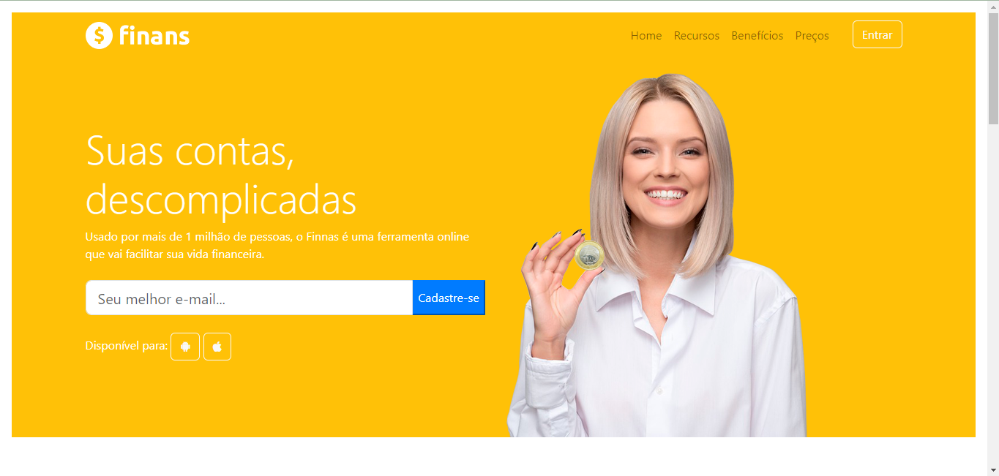

# Finans - Página Web de Finanças Pessoais

Bem-vindo à página Finans! Este repositório contém o código HTML e CSS para nosso site de finanças pessoais.

## Descrição
Finans é uma ferramenta online projetada para simplificar sua vida financeira. Com mais de 1 milhão de usuários, nossa plataforma oferece recursos para ajudar você a controlar suas finanças de forma eficaz.

## Recursos Principais
- **Design Responsivo:** Nosso site é completamente responsivo para que você possa acessá-lo em qualquer dispositivo.
- **Navegação Intuitiva:** A barra de navegação superior facilita a movimentação pelo site.
- **Cadastro Simples:** Cadastre-se rapidamente com seu e-mail e comece a usar nossos recursos.
- **Visualização Gráfica:** Oferecemos gráficos simples para você entender de onde vem e para onde vai o seu dinheiro.
- **Alertas Financeiros:** Receba alertas sobre contas a pagar e a receber para manter suas finanças em dia.
- **Fácil de Usar:** O Finans é projetado para ser simples e eficaz, tornando o controle financeiro mais acessível.
- **Suporte Amigável:** Nosso suporte está sempre disponível para ajudar a resolver suas dúvidas e problemas.

## Capturas de Tela

*Página Inicial*

*Visualização Gráfica*

*Alertas Financeiros*

## Contribuição
Se você quiser contribuir para este projeto, fique à vontade para abrir problemas ou enviar solicitações de pull.

Esperamos que você aproveite a experiência com o Finans e que ele simplifique sua vida financeira!

Para mais informações, visite nosso site [Finans](https://www.finans.com).
